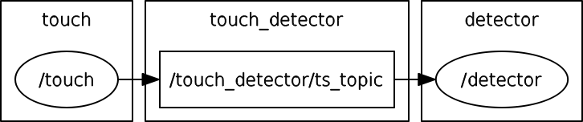

Demos using Android  
===================

Demo #1 implements sensing (of GPS, compass, touch screen) and controlling (of speaker volume) of Android device via ROS-enabled Android application using Gradle-Android studio environment. 
This demo is sensing GPS, compass, and touch screen coordinate from Android device, and publishing those under **android\_gps**, **android\_compass**, and **android\_touch** topics, respectively. 
Radler nodes (named as **gps**, **compass**, and **touch** on the workstation side) are subscribing to corresponding topics and publishing them in Radler world. 
The **controller** Radler node subscribes to topics from **gps**, **compass**, and **touch** Radler nodes, and controls volume of the Android ringtone by publishing ROS topic. 

.. image:: sensor_pubsub_rqt_graph.png

Demo #2 implements touchscreen event detection via ``getevent`` system command and displays on the window of terminal emulator application.

Some additional links:

-  Rosjava/android_core  
   https://github.com/rosjava/android_core
-  Using native ROS code on Android 
   http://wiki.ros.org/android_ndk
-  Android Studio  
   https://developer.android.com/studio
-  Android NDK 
   https://developer.android.com/ndk 

Demo #1 Sensing and controlling of Android device via ROS-enabled Android application using Gradle-Android studio environment
------------------------------------------------------------------------------------------------------------------------------

Our example included in android\_core directory is based on the tutorial example (android\_tutorial\_pubsub) from 
https://github.com/rosjava/android_core. 

Install Android studio, and import android\_core project to compile/generate/install signed apk file via Android studio (recommended). 

Alternatively, you can use Gradle command as below. 

:: 

    cd /path/to/radler/examples/android/android_core

Edit ``sdk.dir`` in *local.properties*.

::

    sdk.dir=/path/to/android/sdk

Execute a build with the Wrapper.

::

    sudo ./gradlew

If you are not using Android studio, you need to sign your unsigned apk *android_tutorial_pubsub-release-unsigned.apk* under *android\_tutorial\_pubsub/build/output/apk*, and install signed apk.

::

    cd /path/to/radler/examples/android/android_core/android_tutorial_pubsub/build/output/apk
    keytool -genkey -v -keystore debug.keystore -alias radler -keyalg RSA -keysize 2048 -validity 20000
    jarsigner -verbose -keystore debug.keystore android_tutorial_pubsub-release-unsigned.apk radler  
    adb install  android_tutorial_pubsub-release-unsigned.apk

For ease of testing, USB tethering can be used. Note that USB tethering is not required for deployment.
Enable USB tethering mode on your Android device. ``ifconfig`` on your workstation will show you the ``usb0`` interface.

::

    usb0  Link encap:Ethernet  HWaddr xx:xx:xx:xx:xx:xx
          inet addr:192.168.42.11  Bcast:192.168.42.255  Mask:255.255.255.0

Set environment variables on your workstation.

::

    export ROS_MASTER_URI=http://192.168.42.11:11311
    export ROS_HOSTNAME=192.168.42.11 

Run ROS master on your workstation.

::

    roscore 

Edit *master_ip* in
*examples/android/sensor\_pubsub/sensor\_pubsub.radl* if needed.  

:: 
    
    DEFS 
       master_ip: string "192.168.42.11" 

Run the sensor\_pubsub example. Note that when you open a new terminal to run Radler nodes, set environment variables (i.e., ROS_MASTER_URI and ROS_HOSTNAME).

::

    mkdir -p /tmp/catkin_ws/src
    cd /path/to/radler
    ./radler.sh --ws_dir /tmp/catkin_ws/src compile examples/android/sensor_pubsub/sensor_pubsub.radl --plant plant --ROS
    cd /tmp/catkin_ws  
    catkin_make 
    cd /tmp/catkin_ws/devel/lib/sensor_pubsub
    ./gps 
    ./compass 
    ./touch  
    ./controller 

When you start **PubSubTutorial** application on your Android device, enter *Master_URI* as your workstation IP (*192.168.42.11* in this demo).
You can now observe your compass and GPS coordinates on the top of the screen. When you touch the screen, the ringtone sound will be played with volume that is proportional to the ratio of current x-coordinate and screen width. 

Demo #2 Touchscreen event detector using Android NDK  
----------------------------------------------------

Prepare build environment to build native ROS nodes using the Android NDK as described in http://wiki.ros.org/android_ndk/Tutorials/BuildingNativeROSPackages. *do\_docker.sh* takes some time to complete.  

::

    git clone https://github.com/ekumenlabs/roscpp_android.git
    cd roscpp_android  
    ./do_docker.sh

Copy *do\_radler.sh* script to the Docker workspace for cross compilation of Radler nodes.  

::

    cp /path/to/radler/examples/android/do_radler.sh /path/to/roscpp_android/

Edit *android\_ip* and *master_ip* in
*examples/android/touch\_detector/touch\_detector.radl* if needed.  
The *android\_ip* is your Android device's IP (*192.168.42.129* in this demo). The *master\_ip* is your workstation's IP (i.e., Ubuntu machine where you run ROS master; *192.168.42.11* in this demo). Refer to http://wiki.ros.org/ROS/EnvironmentVariables for further explanation.

::

    DEFS 
       android_ip: string "192.168.42.129" 
       master_ip: string "192.168.42.11" 

Set environment variables on your workstation. 

::

    export ROS_MASTER_URI=http://192.168.42.11:11311
    export ROS_HOSTNAME=192.168.42.11 

Run ROS master on your workstation.

::

    roscore 

Compile the touch\_detector example.

::

    cd /path/to/radler
    ./radler.sh --ws_dir=/path/to/roscpp_android/output/catkin_ws/src compile examples/android/touch_detector/touch_detector.radl --plant plant --ROS
    sudo docker run --rm=true -t -v /path/to/roscpp_android:/opt/roscpp_android -v /path/to/roscpp_android/output:/opt/roscpp_output -i ekumenlabs/rosndk /opt/roscpp_android/do_radler.sh /opt/roscpp_output

Copy Radler nodes for the `touch\_detector` example.

::

    cd /path/to/roscpp_android/output/catkin_ws/devel/lib/touch_detector
    adb push touch /data/data
    adb push detector /data/data

Run **touch** Radler node on your Android device. On your workstation, connect to you Android device via ADB.

:: 

    adb shell 
    su
    mount -o rw,remount /
    export ROS_MASTER_URI=http://192.168.42.11:11311
    export ROS_HOSTNAME=192.168.42.129
    cd /data/data
    ./touch      
    
Run **detector** Radler node.

::

    adb shell
    su
    export ROS_MASTER_URI=http://192.168.42.11:11311
    export ROS_HOSTNAME=192.168.42.129
    cd /data/data
    ./detector

Alternatively, run Radler node on your Android device. Download an Android application (.apk) for Terminal Emulator for Android (e.g., https://github.com/jackpal/Android-Terminal-Emulator), and run it on your Android device. On the terminal emulator, run the following commands.

::  

    su
    export ROS_MASTER_URI=http://192.168.42.11:11311
    export ROS_HOSTNAME=192.168.42.129
    cd /data/data
    ./detector

Now you will see **O** on both windows (i.e., Android Terminal Emulator and ADB shell) when you touch your Android's screen. Otherwise **X** will be displayed. 
