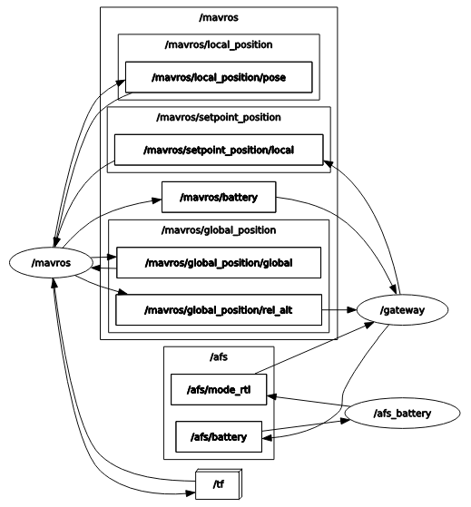
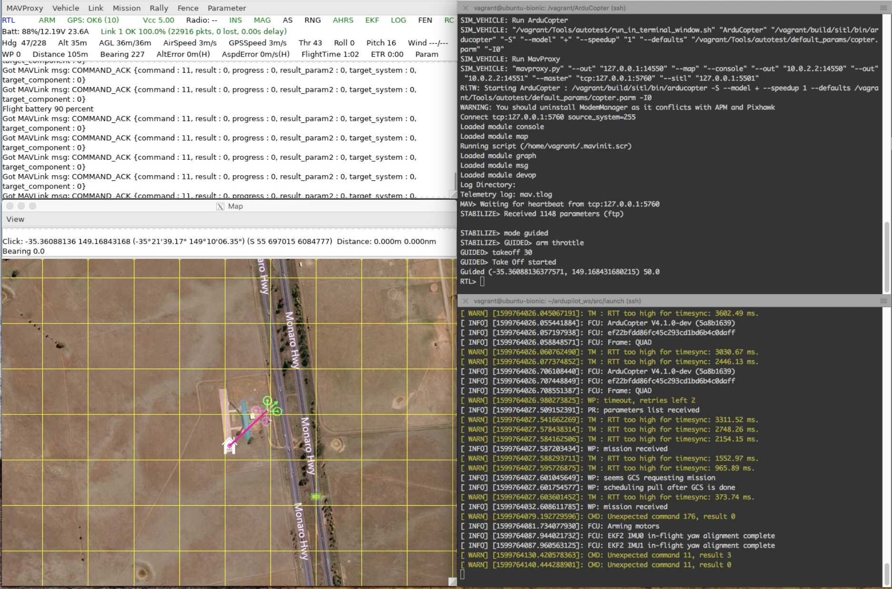

Advanced Fail Safe of Arducopter using MAVROS
=============================================

This demo shows the Radler code generation and its execution on SITL (software in the loop) simulator for the Arducopter advanced fail safe. In this demo MAVROS, ROS-based extendable communication node, on the companion computer communicates with ground control system.

Radler architecture consists of the logical and physical parts.  The logical part is specified in terms of node and topic similar to ROS. The nodes execute independently and periodically, and subscribe from and publish to topics. For example, battery node executes its step function with period of 100 milli seconds, subscribes from battery status topic, and publishes to mode change topic. Physical parts map nodes to the process on specific machines, in this case companion computer.
The step function of battery node controls mode to return to takeoff location when battery level below threshold.
The step function of gateway node forwards back-and-forth messages between Radler and ROS worlds on the companion computer.
Radler build process generates the glue code for scheduling, communication, and failure detection such as timeout or stale.

The above graph shows the nodes and topics used in this demo. Note that we are using ROS service to change the flight mode which is not shown here. Also gateway subscribes from the relative altitude topic which will be used for another Radler node for altitude-related control such as altitude hold.

More information on Ardupilot can be found from ArduPilot Development Site https://ardupilot.org/dev/index.html.

Set up the SITL/MAVROS/Radler in a virtual machine environment using Vagrant.

::

  git clone https://github.com/ArduPilot/ardupilot.git
  cd ardupilot
  cp /path/to/radler-ros2-branch/example/ardupilot/vagrant/Vagrantfile .
  vagrant up
  vagrant ssh
  cd /vagrant
  git submodule update --init --recursive
  exit

Start SITL simulator.

::

  vagrant ssh -c "sim_vehicle.py -v ArduCopter --console --map -m --out=127.0.0.1:14550"

Connect MAVROS with SITL.

:: 

  vagrant ssh -c "ros2 launch mavros apm.launch.py"

Left two windows of the below snapshot show the ground control console and map of the environment launched from the SITL simulator on the top right window. On the right bottom window, one can observe some verbose that reads the Arducopter's configuration, which indicates a connection.

.. image:: ./sitl_mavros.png  
   :height: 300

Launch Radler nodes (in different terminals for more clarity). 
The battery status topic published in the ROS side is subscribed by the gateway node which forwards it to the battery node on the Radler side via Radler pub/sub channel. 

::

  vagrant ssh -c "source ~/ros2_ws/install/local_setup.bash; ~/ros2_ws/install/afs/bin/gateway"
  vagrant ssh -c "source ~/ros2_ws/install/local_setup.bash; ~/ros2_ws/install/afs/bin/afs_battery"

On the simulator side (upper right window of below snapshot), change the Arducopter's mode to GUIDED, arm throttle, then takeoff to an altitude (e.g., 30 meters) and one can observe the console window changing battery level and altitude.

::

  mode guided
  arm throttle
  takeoff 30

On the map (bottom left window), create a target position with altitude, then observe the Arducopter flying to the target.

.. image:: ./takeoff.png  
   :height: 300

When the battery level hits below threshold (i.e., 90%) the mode change to return to takeoff location is published by battery node. The gateway node subscribes from it and calls ROS service to set custom mode of the Arducopter. Note that the mode change to RTL on the simulator side.

On the map window of below snapshot, one can observe that the Arducopter heading to the takeoff location.

The altitude value on the ground control console indicates that the Arducopter landing to the takeoff location.

For the inception of Java code in the step function, we provide a use-case with Java Native Interface (JNI). The step function of esp (event stream processing) node calculates point distance between two successive (x,y) positions. BeepBeep (https://liflab.github.io/beepbeep-3/) is used for event stream processing engine. We modified BeepBeep code example of PointDistance given in https://liflab.github.io/beepbeep-3-examples/_point_distance_8java_source.html. The *afs.radl* includes *cmake_library* information for JNI. JVM creation should be in the class constructor (refer *afs\_esp.h*) and JNI calls in the step function (refer *afs\_esp.cpp*).

To install BeepBeep 3 examples:

::

  vagrant ssh
  cd ~
  git clone https://github.com/liflab/beepbeep-3-examples.git
  cd beepbeep-3-examples
  edit config.xml
    <zip>https://github.com/liflab/beepbeep-3-palettes/releases/download/v20181124/beepbeep-3-palettes-v20181124.zip</zip>
    to 
    <zip>https://github.com/liflab/beepbeep-3-palettes/releases/download/v20190917/beepbeep-3-palettes-v20190917.zip</zip>
  ant download-deps
  mkdir -p Core/src
  mkdir doc
  ant

To compile Java-side code, CLASSPATH should include the above *beepbeep-3-examples.jar* (refer *./vagrant/setup.bash*):

::

  cd ~/radler/examples/ardupilot/jni
  javac PointDistance.java
 
To run, CLASSPATH should include *beepbeep-3-examples.jar* and */path/to/radler/examples/ardupilot/jni* (refer *./vagrant/setup.bash*):

::

  source ~/ros2_ws/install/local_setup.bash
  cd ~/ros2_ws/install/afs/bin
  ./afs_esp

If DAIKON invariant detector (https://plse.cs.washington.edu/daikon/) is enabled in *afs.radl*, *.dtrace.gz* file will be created in *~/ros2_ws/install/afs/bin* directory.

We utilize Apache Log4j 2 (https://logging.apache.org/log4j/2.x/) for logging purpose.
Refer *./jni/log4j2.properties* for log4j2 properties to configure RollingFileAppender and to disable JNDI lookup.

::

  source ~/ros2_ws/install/local_setup.bash
  cd ~/ros2_ws/install/afs/bin
  ./afs_log

The RollingFileAppender in Log4j will create *afs.log* file in *~/ros2_ws/install/afs/bin* directory to backup the altitude information.

To regenerate and recompile from the RADL file:

::

  cd ~/radler
  ./radler.sh --ws_dir ~/ros2_ws/src compile examples/ardupilot/afs.radl --plant plant --ROS
  cd ~/ros2_ws
  colcon build --cmake-args -DSECURITY=ON --no-warn-unused-cli --symlink-install

Demo with SROS2
---------------

To generate a keystore, keys and certificates (refer *./vagrant/sros_keystore.bash*):

::

  cd ~/ros2_ws
  ros2 security create_keystore sros2_keys
  ros2 security create_key sros2_keys /afs/mavros
  ros2 security create_key sros2_keys /afs/gateway
  ros2 security create_key sros2_keys /afs/afs_battery
  ros2 security create_key sros2_keys /afs/afs_esp
  ros2 security create_key sros2_keys /afs/afs_log

To define the SROS2 environment variables (refer *./vagrant/sros_env.bash*):
::

  export ROS_SECURITY_KEYSTORE=/home/vagrant/ros2_ws/sros2_keys
  export ROS_SECURITY_ENABLE=true
  export ROS_SECURITY_STRATEGY=Enforce
  export RMW_IMPLEMENTATION=rmw_fastrtps_cpp

To launch MAVROS with SROS2:

::

  ros2 launch mavros apm_sros2.launch.py

To run each node such as gateway node (refer *./vagrant/sros_env.bash*):

::

  source ~/ros2_ws/install/local_setup.bash
  source ~/radler/examples/ardupilot/vagrant/sros_env.bash
  ros2 run afs gateway --ros-args --enclave /afs/gateway

Security access controls are defined in *permissions.xml* file.
To demonstrate a policy which only allows *gateway* node publishing messages on the specific topics such as those in *afs.radl* file:

::

  cd ~/ros2_ws/sros2_keys/enclaves/afs/gateway
  edit <publish><topics> part of permissions.xml
    replace
      <topic>rt/*</topic>
    with
      <topic>rt/afs/rel_alt</topic>
      <topic>rt/afs/global_position_local</topic>
      <topic>rt/afs/battery</topic>
      <topic>rt/parameter_events</topic>
      <topic>rt/rosout</topic>
      <topic>*/gateway/*</topic>

To sign a new policy file *permissions.p7s* from the updated XML file *permissions.xml*:

::

  openssl smime -sign -text -in permissions.xml -out permissions.p7s --signer permissions_ca.cert.pem -inkey ~/ros2_ws/sros2_keys/private/permissions_ca.key.pem

With the updated permissions, remapping the *battery* topic will fail.

::

  ros2 run afs gateway --ros-args --enclave /afs/gateway --remap /afs/battery:=/afs/not_battery
