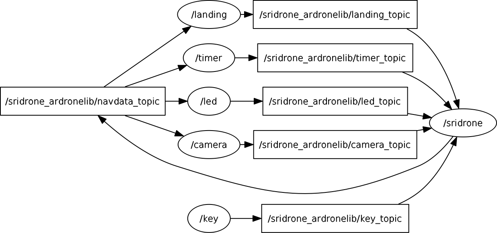

Demos using AR.Drone on ROS
=======================================

| Demos are available for two types of AR.Drone drivers: Demo \#1 with **ardronelib**
  (AR.Drone sdk) and Demo \#2 with **ardrone\_autonomy** (ROS driver).
| Both demos consists of at least three nodes **sridrone**, **led**, and
  **camera**, and three topics **navdata**, **led\_anim**, and
  **camera\_param**. The **sridrone** node publishes **navdata** and
  subscribes to **led\_anim** and **camera\_param** to generate signals
  that control LED animation and video input. The **led** node
  subscribes to **navdata** and publishes **led\_anim** to indicate
  unstable roll (LEFT\_GREEN\_RIGHT\_RED or LEFT\_RED\_RIGHT\_GREEN) or
  low battery level (BLINK\_RED). The **camera** node subscribes to 
  **navdata** and publishes **camera\_param** to toggle the video feed
  between front/bottom cameras.
| Demo \#1 additionaly supports for three other nodes: **key**, **timer**, and **landing**.  
  The **key** node provides drone flight control using keyboard. The **timer** node provides timer-based drone flight control, e.g., landing after 2 seconds of hovering over 50cm. 
  The **landing** node provides altitude-based landing, e.g., landing if the altitude is less than 50cm.  

Some additional links:

-  AR.Drone Developer Guide
   http://www.msh-tools.com/ardrone/ARDrone\_Developer\_Guide.pdf
-  Parrot developer site for SDK
   http://developer.parrot.com/docs/SDK3/#how-to-build-the-sdk
-  Control the AR.Drone LEDs
   http://gauth.fr/2011/09/control-the-ar-drone-leds/

Demo #1 with sridrone\_ardronelib
---------------------------------

Compile up-to-date ardronelib sdk.

::

    git submodule update --init --recursive 
    cd examples/drone/sridrone_ardronelib/ardronelib
    make 
    sudo make install --makefile=../Makefile INSTALL_PREFIX=/usr/local

Edit *drone\_ip* in
*examples/drone/sridrone\_ardronelib/sridrone\_ardronelib.radl* with
your drone's IP if needed.

::

    DEFS 
       drone_ip: string "192.168.1.xxx" 

Run ROS master.

::

    roscore 

Run the sridrone\_ardronelib example.

::

    mkdir -p /tmp/catkin_ws/src
    cd /path/to/radler
    ./radler.sh --ws_dir /tmp/catkin_ws/src compile examples/drone/sridrone_ardronelib/sridrone_ardronelib.radl --plant plant --ROS  
    cd /tmp/catkin_ws  
    catkin_make 
    cd /tmp/catkin_ws/devel/lib/sridrone_ardronelib
    ./sridrone 
    ./led
    ./camera 
    ./key 
    ./timer 
    ./landing 

Demo #2 with sridrone\_ardrone\_autonomy
----------------------------------------

Download and install ROS ardrone\_driver from
https://github.com/AutonomyLab/ardrone\_autonomy.git.

::

    sudo apt-get install ros-indigo-ardrone-autonomy 

.. raw:: html

    <!--
    cd ~/catkin_ws/src
    git clone https://github.com/AutonomyLab/ardrone_autonomy.git -b indigo-devel
    cd ~/catkin_ws
    rosdep install --from-paths src -i 
    catkin_make 

    catkin_make install 
    source devel/setup.bash 
    export CPLUS_INCLUDE_PATH=~/catkin_ws/devel/include
    -->

Run ROS master and ardrone\_driver.

::

    roscore 
    rosrun ardrone_autonomy ardrone_driver 

Note. Use *-ip ${Your Drone's IP address}* if your drone does not have
the default IP address.

::

    rosrun ardrone_autonomy ardrone_driver -ip 192.168.1.xxx

Run the sridrone\_ardrone\_autonomy example.

::

    cd /path/to/radler 
    ./radler.sh --ws_dir /tmp/catkin_ws/src compile examples/drone/sridrone_ardrone_autonomy/sridrone_ardrone_autonomy.radl --plant plant --ROS 
    cd /tmp/catkin_ws  
    catkin_make 
    cd /tmp/catkin_ws/devel/lib/sridrone_ardrone_autonomy
    ./sridrone 
    ./led
    ./camera

Run ros **image\_view** node to check the camera feed.

::

    sudo apt-get install ros-indigo-image-view
    rosrun image_view image_view image:=/ardrone/front/image_raw
    rosrun image_view image_view image:=/ardrone/bottom/image_raw

