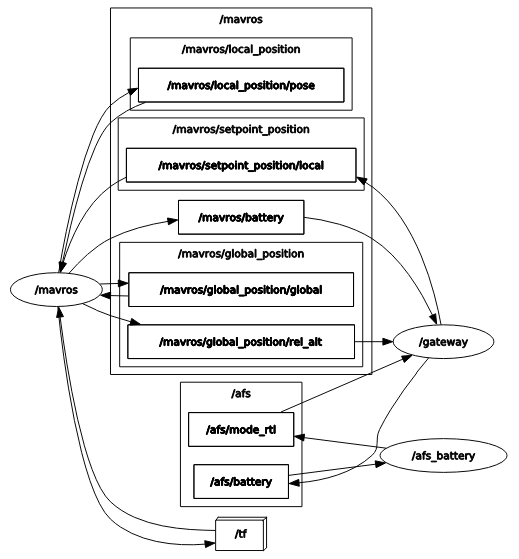

Advanced Fail Safe of Arducopter using MAVROS (Vagrant) 
=======================================================

This demo shows the Radler code generation and its execution on SITL (software in the loop) simulator for the Arducopter advanced fail safe. In this demo MAVROS, ROS-based extendable communication node, on the companion computer communicates with ground control system.

Radler architecture consists of the logical and physical parts.  The logical part is specified in terms of node and topic similar to ROS. The nodes execute independently and periodically, and subscribe from and publish to topics. For example, battery node executes its step function with period of 100 milli seconds, subscribes from battery status topic, and publishes to mode change topic. Physical parts map nodes to the process on specific machines, in this case companion computer.
The step function of battery node controls mode to return to takeoff location when battery level below threshold.
The step function of gateway node forwards back-and-forth messages between Radler and ROS worlds on the companion computer.
Radler build process generates the glue code for scheduling, communication, and failure detection such as timeout or stale.

The above graph shows the nodes and topics used in this demo. Note that we are using ROS service to change the flight mode which is not shown here. Also gateway subscribes from the relative altitude topic which will be used for another Radler node for altitude-related control such as altitude hold.

More information on Ardupilot can be found from ArduPilot Development Site https://ardupilot.org/dev/index.html.

Set up the SITL/MAVROS/Radler in a virtual machine environment using Vagrant.

::

  git clone https://github.com/ArduPilot/ardupilot.git
  cd ardupilot
  git checkout 5a8b1639d0a36c882b67495a101ef2284027fca7
  cp /path/to/radler/example/ardupilot/vagrant/Vagrantfile .
  vagrant up
  vagrant ssh
  cd /vagrant
  git submodule update --init --recursive
  exit

Start SITL simulator.

::

  vagrant ssh -c "sim_vehicle.py -v ArduCopter --console --map -m --out=127.0.0.1:14550"

Connect MAVROS with SITL.

:: 

  vagrant ssh -c "roslaunch apm.launch fcu_url:=\"udp://127.0.0.1:14550@\""

Left two windows of the below snapshot show the ground control console and map of the environment launched from the SITL simulator on the top right window. On the right bottom window, one can observe some verbose that reads the Arducopter's configuration, which indicates a connection.

.. image:: sitl_mavros.png  
   :height: 300

Launch Radler nodes (in different terminals for more clarity). 
The battery status topic published in the ROS side is subscribed by the gateway node which forwards it to the battery node on the Radler side via Radler pub/sub channel. 

::

  vagrant ssh -c "/tmp/catkin_ws/devel/lib/afs/gateway"
  vagrant ssh -c "/tmp/catkin_ws/devel/lib/afs/battery"

On the simulator side (upper right window of below snapshot), change the Arducopter's mode to GUIDED, arm throttle, then takeoff to an altitude (e.g., 30 meters) and one can observe the console window changing battery level and altitude.

::

  mode guided
  arm throttle
  takeoff 30

On the map (bottom left window), create a target position with altitude, then observe the Arducopter flying to the target.

.. image:: takeoff.png  
   :height: 300

When the battery level hits below threshold (i.e., 90%) the mode change to return to takeoff location is published by battery node. The gateway node subscribes from it and calls ROS service to set custom mode of the Arducopter. Note that the mode change to RTL on the simulator side.

On the map window of below snapshot, one can observe that the Arducopter heading to the takeoff location.

The altitude value on the ground control console indicates that the Arducopter landing to the takeoff location.

.. image:: rtl.png  
   :height: 300
