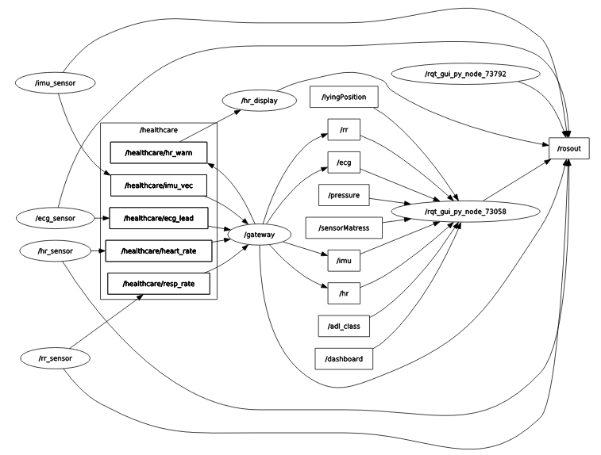
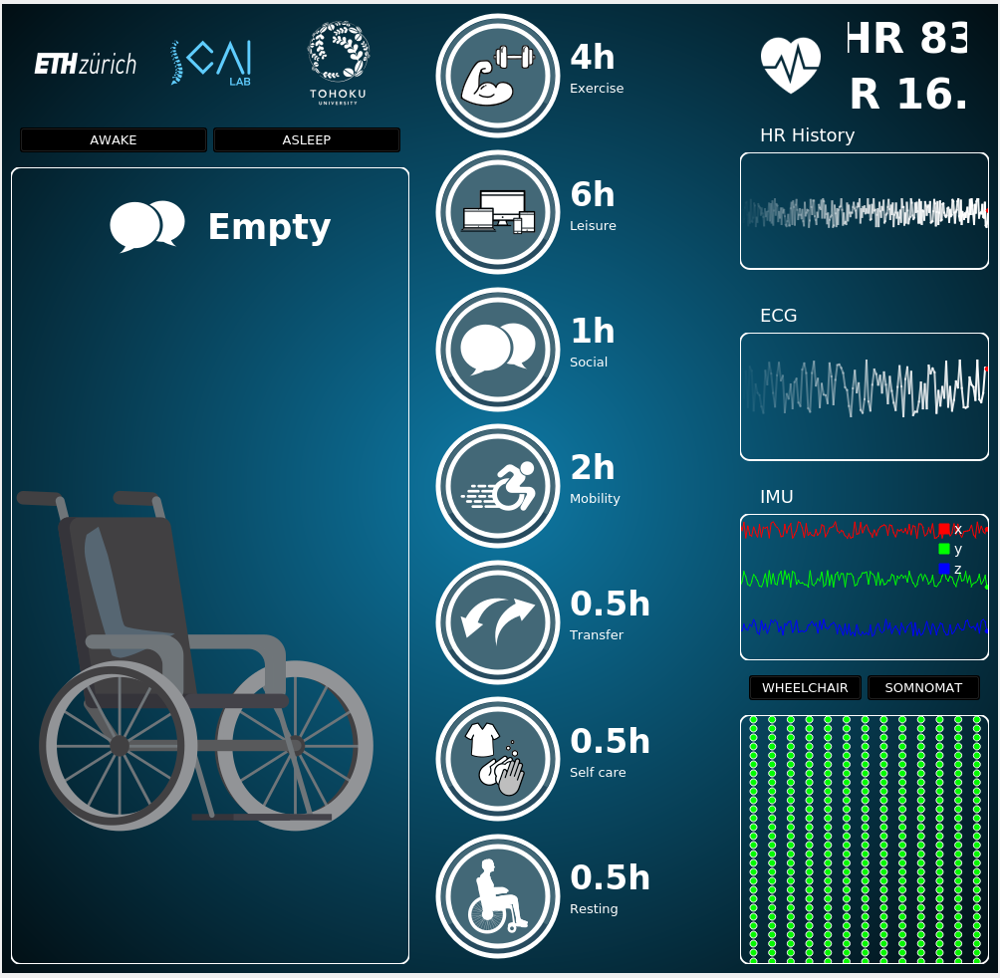

System Overview
---------------

This demo shows the Radler code generation and its execution with the `ros4healthcare <https://github.com/SCAI-Lab/ros4healthcare.git>`_ package.  

Radler architecture consists of the logical and physical parts. The logical part is specified in terms of node and topic similar to ROS. The nodes execute independently and periodically, and subscribe from and publish to topics.
A physical specification is provided by a value of type plant. 

In this use case, six *Radler* nodes (shown as ellipses) communicate via five *Radler* topics 
(shown as rectangles under ``/healthcare``) and several *ROS* topics 
(``/rr``, ``/hr``, ``/imu``, and ``/ecg`` for respiration rate, heart rate, IMU, 
and ECG, respectively).

- **Gateway Node**:

  Subscribes to four topics (``heart_rate``, ``resp_rate``, ``imu_vec``, and 
  ``ecg_lead``), executes its step function to check if the heart rate is within
  the normal range, and publishes to the ``hr_warn`` Radler topic to signal
  the ``hr_display`` node. It also publishes to ROS message types
  ``/rr``, ``/hr``, ``/imu``, and ``/ecg`` defined in the *ros4healthcare* package.

- **Sensor Nodes**:

  Publish to ``resp_rate``, ``heart_rate``, ``imu_vec``, and ``ecg_lead``, respectively. These nodes simulate physical sensors by generating data points.

- **HR Display Node**:

  Subscribes to ``hr_warn``; executes its step function every 100 milliseconds
  to display any warning signal.

- **Dashboard Node**:

  Shown as ``/rqt_gui_py_node_73058`` in the rqt graph above. It acts as
  a dashboard, as shown below, subscribing to several ROS topics (e.g.,
  ``/rr``, ``/hr``, ``/imu``, and ``/ecg``) to visualize them. For more details, refer to
  `ros4healthcare <https://github.com/SCAI-Lab/ros4healthcare.git>`_.

Excerpt from the example system’s RADL description below:

::

  heart_rate : topic { FIELDS hr : float32 0 }
  resp_rate : topic { FIELDS rr : int32 0 }
  imu_vec : topic { FIELDS x : int32 0 y : int32 0 z : int32 0 }
  ecg_default : array { SIZE 60 TYPE "int32" VALUES 1 0 0 0 0 0 0 0 0 0 0 0 0 0 0 0 0 0 0 0 0 0 0 0 0 0 0 0 0 0 0 0 0 0 0 0 0 0 0 0 0 0 0 0 0 0 0 0 0 0 0 0 0 0 0 0 0 0 0 60 }
  ecg_lead : topic { FIELDS ecg = ecg_default }

  hr_warn : topic { FIELDS val : bool false }

  gateway : node {
    SUBSCRIBES 
      hr { TOPIC heart_rate MAXLATENCY 100msec }
      rr { TOPIC resp_rate MAXLATENCY 100msec }
      imu { TOPIC imu_vec MAXLATENCY 100msec }
      ecg { TOPIC ecg_lead MAXLATENCY 100msec }
    PUBLISHES
      hr_warning { TOPIC hr_warn }
    PERIOD 100msec
    PATH "src"
    CXX { HEADER "gateway.h" FILENAME "gateway.cpp" CLASS "Gateway" LIB sensor_msgs ros_healthcare_msg std_msgs }
  } 

A node is described with fields such as ``PERIOD``, ``PUBLISHES``, and
``SUBSCRIBES``. When the ``gateway`` node is created, Radler
constructs one instance of the provided C++ class specified in the
``CXX`` field. The step function of this instance will be called at a
fixed frequency defined by the node’s period (the ``PERIOD`` field). At
each call, the step function is provided with the messages received from
its subscriptions and is required to write the messages that it has to
publish (the ``SUBSCRIBES`` and ``PUBLISHES`` fields). A topic is
uniquely defined by its name. For example, ``heart_rate``, ``rest_rate``, 
``imu_vec``, and ``ecg_lead`` topics are referenced as
``hr``, ``rr``, ``imu``, and ``ecg``, respectively. The ``gateway`` node publishes to the
``hr_warn`` topic, which is referenced as ``hr_warning``, and the ``hr_display``
node subscribes to that topic. A topic is a purely logical way of defining
point-to-point communications between one producer and multiple
consumers. The communication occurs via bounded latency channel (the ``MAXLATENCY``
field) for each topic.

Below code segment shows the step function of the ``gateway`` node,
that is provided by the user (C++ class specified in the ``CXX`` field
under the directory specified in the ``PATH`` field, as being
exemplified in the RADL description above).

::

  Gateway::Gateway()
  {
    node = rclcpp::Node::make_shared("gateway");

    hr_pub = node->create_publisher<ros_healthcare_msg::msg::HR>("hr", rclcpp::SensorDataQoS());
    //...
  }
  void Gateway::step(const radl_in_t* i, const radl_in_flags_t* i_f, radl_out_t* o, radl_out_flags_t* o_f) 
  {
    double hr = i->hr->hr;
    int rr = i->rr->rr;

    if (!radl_is_stale(i_f->hr) && !radl_is_timeout(i_f->hr)) {
      rclcpp::spin_some(node);
      ros_healthcare_msg::msg::HR hr_msg;
      hr_msg.hr = hr;
      hr_pub->publish(hr_msg);
      if (hr > 98) 
        o->hr_warning->val = true;
      else if (hr < 62) 
        o->hr_warning->val = true;
      else 
        o->hr_warning->val = false;
    }
    //...
  }

A class is instantiated with the default constructor to create an
instance representing the state of the Mealy machine. Subsequently, the
step function of this instance is invoked to execute one step of the
machine. The signature of the step function should specify the input
(``radl_in_t*``) and output (``radl_out_t*``) structures define the
node’s subscription and publication, respectively. In the example, the
step function of the ``gateway`` node checks whether the sensed heart rate is within the normal range and, if necessary, 
publishes a corresponding topic to signal a warning. 
Note that the ``gateway`` node forwards back-and-forth messages between Radler and ROS worlds by creating a ROS publisher in its 
constructor.  It publishes ``ros_healthcare_msg`` to the corresponding ROS topic and also publishes ``hr_warning`` to the Radler topic.  
The flag structures
(``radl_inflags_t*, radl_outflags_t*``) can be used to check if a
subscription is stale or timeout by calling
``radl_is_stale(iflag->hr)`` or
``radl_is_timeout(iflag->hr)``, respectively. By default, these
Boolean metadata attached to messages are propagated through
nodes unless the explicitly being turned off (``radl_turn_off``).

RADL and Build Process
----------------------

A system consisting of these nodes was defined using a *RADL* description, with 
user code in each node's step function. The *Radler* build process generates 
“glue code” for scheduling, communications, and failure detection, ultimately 
producing the executables.

To test with Docker 
-------------------

To build the radler/healthcare docker container::

  docker build -t radler/healthcare .

To run (on macOS):: 

  docker run -it -e DISPLAY=host.docker.internal:0 radler/healthcare bash

To run (on Xubuntu):: 

  sudo docker run -it -v /tmp/.X11-unix:/tmp/.X11-unix -e DISPLAY=:0 radler/healthcare bash  

Within the container::

  cd ~/radler/
  ./radler.sh --ws_dir /tmp/ros2_ws/src compile examples/healthcare/healthcare.radl --plant plant --ROS
  cd /tmp/ros2_ws/
  colcon build
  source install/local_setup.bash
  xterm -e "ros2 run healthcare gateway" &      # execute radler gateway  
  xterm -e "ros2 run healthcare hr_sensor" &    # execute radler nodes, e.g., hr_sensor
  ros2 run dashboard dashboard                  # execute ros4health dashboard 

Troubleshooting 
---------------

**Error Message:**

xhost: unable to open display "host.docker.internal:0"

**Steps to Fix:**

  1. Open Xquartz settings, go to the Security tab
  2. Make sure “Authenticate connections” is unchecked and “Allow connections from network clients” is checked
  3. Restart Xquartz
